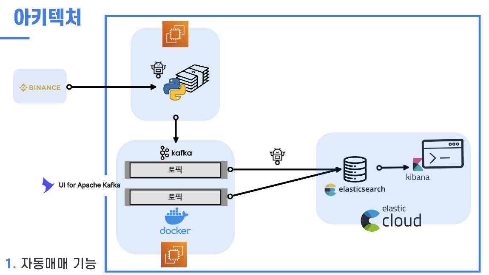
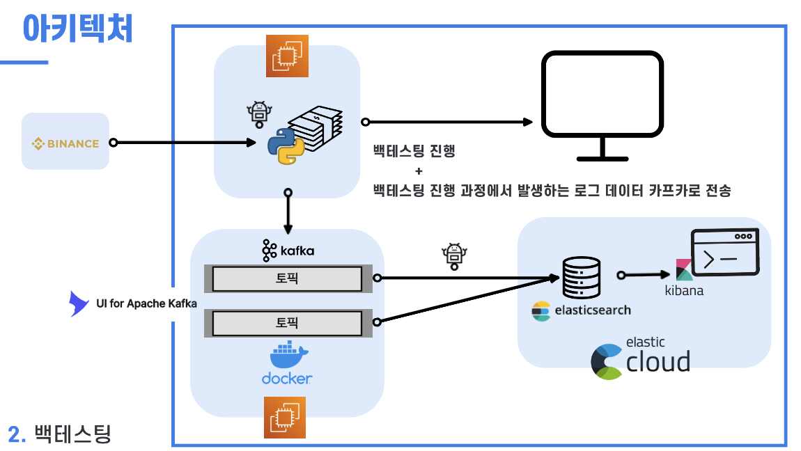
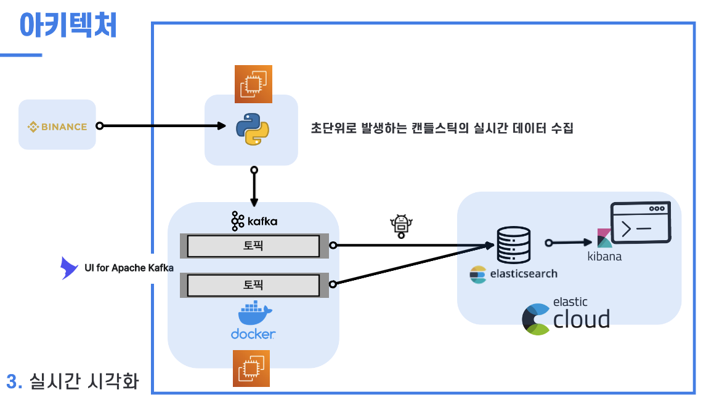

# 구해줘 내 지갑, 암호화폐 자동 봇 매매  
 

## 연세대학교 빅데이터 학회 YBIGTA 23-1학기 컨퍼런스입니다.
팀원 : 국호연(21기 DE), 김수환(22기 DS), 박찬길(21기 DE), 송우석(21기 DE), 이다영(21기 DA)  
 

## 프로젝트 소개
알고리즘 트레이딩은 투자에 있어서 사람의 충동적인 결정을 막고, 차트를 보면서 시간을 들여야 할 필요가 없기에 엄청난 시간 save가 가능합니다. 저희 팀은 암호화폐 거래 데이터를 기반으로 다양한 투자지표를 조합하는 백테스팅을 통해 효과적인 전략을 연구하였습니다. 해당 전략을 기반으로 자동으로 매매를 하는 암호화폐 봇을 만들었고 이에 대한 결과를 시각화하였습니다.  
 

## 사용한 기술 스택
- Python
    - Python 3.10
- Binance API
- Kafka
- AWS
    - AWS EC2
- Elastic Cloud
    - Elasticsearch
    - Kibana
- Docker, Docker-compose
 

## 사용한 자동 매매 전략
- Strategy ① (Basic) - RSI + MACD + CCI
- Strategy ② (Custom) - Engulfing Candle Indicator + RSI
(자세한 전략은 하단에 링크한 발표자료 참고)
 

## 프로젝트 기능별 아키텍처
총 세 가지 기능이 존재

1. 실제 Binance의 5분 봉, 1시간 봉 차트에 따른 자동 매매 기능(프로젝트의 기본 아키텍처)
    - Binance API
        - 기본적으로 이더리움 코인의 가격 정보를 받기 위해 binance api를 사용하였고, 웹소켓을 통해 binance api에서 실시간으로 캔들스틱의 마감 시간, 시가, 종가, 고가, 저가, 볼륨과 같은 기본 거래 데이터를 가져온 후, 그걸 기반으로 파이썬에서 RSI, MACD, CCI, Engulfing 등을 계산
    - Kafka Producer, Kafka Consumer
        - 앞서 계산한 캔들 스틱이 마감되면서 주기적으로 발생하는 가격 및 지표 정보, 그리고 포지션에 진입하거나 청산할 때마다 발생하는 거래 시간, 거래량, 체결 가격 등을 로그로 남게 하였고, 이러한 로그를 카프카에 적재하도록 파이프라인을 구성하였다.
        - 카프카 프로듀서가 포함된 파이썬 프로그램에서 Binance API를 콜해서 이더리움의 캔들스틱을 받아오면, 해당 캔들스틱을 기반으로 지표를 계산하고, 캔들스틱을 받아올 때마다, 혹은 포지션을 진입/청산하면서 거래가 발생할 때마다, 해당 데이터를 JSON 형식으로 변환하여 각 토픽에 적재되도록 하였다.
        - 또한, 토픽에 적재된 데이터를 Elastic Cloud로 보내 시각화하기 위해 Kafka Consumer로 토픽의 데이터를 읽어서 Elasticsearch로 전송했다.
    - Docker, Docker-compose
        - 카프카는 EC2 인스턴스에 띄운 카프카용 도커 컨테이너에서 동작하도록 하였으며, 카프카에 토픽 상황을 모니터링할 수 있는 웹페이지를 연결하는 컨테이너를 도커 컴포즈로 함께 띄워서 토픽의 관리와 데이터의 흐름을 쉽게 볼 수 있도록 하였다.
    - Elastic Cloud - Elasticsearch & Kibana
        - Elastic Cloud를 기반으로 Elasticseach에 저장된 실시간 코인 데이터, 지표 데이터, 거래 내역은 Kibana를 통해 시각화되어 대시보드에 나타난다.
    - AWS EC2
        - 거래를 위해 필요한 websocket_api_custom.py websocket_api_basic.py, send_log_kafka_to_es.py를 백그라운드로 실행하고, Docker를 설치하여 Kafka Brocker 및 Zookeeper를 실행할 용도의 EC2 인스턴스 사용.
    

 

2. 지난 1년 반과 반년 동안의 이더리움 캔들스틱을 기반으로 전략에 따라 얼마나 매매가 발생했는지 시뮬레이션하는 백테스팅하는 기능
    - plotly를 이용하여 시각화(basic_strategy_half_year.py, custom_strategy_half_year.py)
    - 위 a번 코드에서 발생한 로그를 Kafka 토픽에 모아 Elasticsearch에 저장하고, Kibana로 시각화

 

3. 2-3초 단위로 실시간으로 발생하는 거래 데이터를 받아 지표를 계산하여 바로 보여주는 기능
    - Binance api에서 전달되는 실시간 캔들스틱을 데이터에서 지표를 계산하고, 해당 데이터를 Kafka 토픽에 JSON 형태로 전달
    - 토픽에 적재된 데이터를 Elasticsearch에 저장하고, Kibana로 시각화하여 거래 데이터가 추가될 때마다 대시보드에 실시간으로 반영

 

## Repository 구성
- docker : 카프카 브로커 서버 및 주키퍼를 실행시키기 위한 Docker 및 Docker-compose 관련 파일이 있는 디렉토리
- backtesting : 반년, 1년 반 기간동안 전략에 따라 백테스팅한 결과를 Plotly로 표현하는 코드가 있는 디렉토리
- auto_trade : 실제 Binance의 5분 봉, 1시간 봉 차트에 따른 자동 매매 기능과 관련된 코드가 있는 디렉토리
- backtesting_trade : 반년, 1년 반 기간동안 전략에 따라 백테스팅한 결과에서 발생하는 로그를 카프카 토픽에 저장하여 Elasticsearch로 불러와 kibana로 시각화하는 기능과 관련된 코드가 있는 디렉토리
- realtime_indicator : 2-3초 단위로 실시간으로 발생하는 캔들스틱을 받아 지표를 계산하여 바로 보여주는 기능과 관련된 코드가 있는 디렉토리

 

## 발표 자료 링크
https://drive.google.com/file/d/1CH2MG1YxFFA_r5Wyh8_fh0ZYMmRyMyAg/view?usp=share_link
